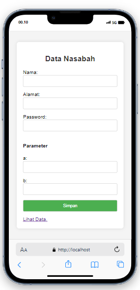
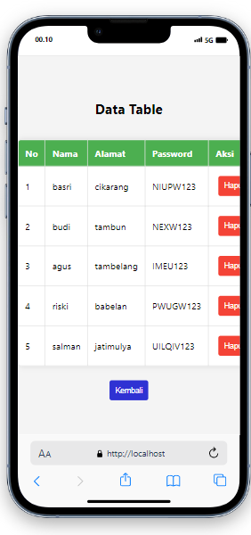
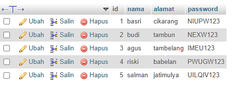

# Uts-Kriptografi
## Soal
Implementasi Affine Cipher pada Sistem Web Data Nasabah

Deskripsi Masalah:
<p>Affine Cipher adalah jenis cipher substitusi yang menggabungkan enkripsi Caesar Cipher dengan perkalian. Anda diinstruksikan untuk menerapkan Affine Cipher sebagai bagian dari lapisan keamanan untuk sistem web yang menangani data nasabah sebuah bank. Setiap password harus dienkripsi sebelum disimpan ke dalam database.

## Cara Menggunakan Aplikasi
<p>1. Buka index.php dan isi formulir dengan data nasabah.
<p>2. Data akan disimpan dalam database "affine_cipher" setelah dienkripsi menggunakan Affine Cipher.
<p>3. Kunjungi data.php untuk melihat data yang telah disimpan.

## Penggunaan Aplikasinya
<p>1. Dalam penggunaan kali ini saya memakai parameter :
    <p>a =5 
    <p>b =8
<p>2. Tabel data tersambung dengan database

### Tampilan Form Data Nasabah

### Tampilan Tabel Data

### Databasenya


## Pembuatan
<h4>1. Membuat Database dan Tabel:</h4>

```
CREATE DATABASE affine_cipher;
USE affine_cipher;
CREATE TABLE user (
    id INT PRIMARY KEY AUTO_INCREMENT,
    nama VARCHAR(255) NOT NULL,
    alamat VARCHAR(255) NOT NULL,
    password VARCHAR(255) NOT NULL,
);
```
<h4>2. Membuat File PHP:</h4>
   <h5>a. Index.php</h5>

```
<!DOCTYPE html>
<html lang="en">
<head>
    <meta charset="UTF-8">
    <meta name="viewport" content="width=device-width, initial-scale=1.0">
    <link rel="stylesheet" href="style.css">
    <title>Formulir Data Nasabah</title>
    <style>
body {
    font-family: Arial, sans-serif;
    background-color: #f4f4f4;
    margin: 0;
    display: flex;
    justify-content: center;
    align-items: center;
    height: 100vh;
}

.container {
    background-color: #fff;
    padding: 20px;
    border-radius: 8px;
    box-shadow: 0 0 10px rgba(0, 0, 0, 0.1);
    width: 300px; /* Menentukan lebar formulir */
    margin: auto; /* Menengahkan formulir */
}

h2 {
    text-align: center;
    color: #333;
}

form {
    display: flex;
    flex-direction: column;
}

label {
    margin-bottom: 8px;
    color: #555;
}

input {
    padding: 10px;
    margin-bottom: 16px;
    border: 1px solid #ccc;
    border-radius: 4px;
}

input[type="submit"] {
    background-color: #4caf50;
    color: #fff;
    cursor: pointer;
}

input[type="submit"]:hover {
    background-color: #45a049;
}

    </style>
</head>
<body>

    <div class="container">
        <h2>Data Nasabah</h2>

    <form action="process.php" method="post">
    Nama: <input type="text" name="nama">
    Alamat: <input type="text" name="alamat">
    Password: <input type="password" name="password">
    <h4>Parameter</h4>
    a: <input type="text" name="a">
    b: <input type="text" name="b">
    <input type="submit" value="Simpan">
    <a class="link-underline link-underline-opacity-0" href="data.php">Lihat Data.</a>
</form>

</body>
</html>

```
  <h5>b. Process.php</h5>
  
```
  <?php

// Fungsi untuk mengenkripsi teks dengan Affine Cipher
function affineEncrypt($text, $a, $b) {
    $result = "";
    $text = strtoupper($text);

    for ($i = 0; $i < strlen($text); $i++) {
        if ($text[$i] != ' ') {
            $result .= chr((($a * (ord($text[$i]) - 65) + $b) % 26) + 65);
        } else {
            $result .= ' ';
        }
    }

    return $result;
}

// Fungsi untuk membersihkan input
function cleanInput($data) {
    $data = trim($data);
    $data = stripslashes($data);
    $data = htmlspecialchars($data);
    return $data;
}

// Periksa apakah formulir telah dikirim
if ($_SERVER["REQUEST_METHOD"] == "POST") {
    
    // Ambil nilai kunci Affine Cipher dari formulir
    $a = cleanInput($_POST["a"]);
    $b = cleanInput($_POST["b"]);

    // Data yang akan disimpan
    
    $nama = cleanInput($_POST["nama"]);
    $alamat = cleanInput($_POST["alamat"]);
    $password = cleanInput($_POST["password"]);

    // Enkripsi password sebelum disimpan ke database
    $encryptedPassword = affineEncrypt($password, $a, $b);

    // Koneksi ke database (gantilah dengan informasi koneksi Anda)
    $servername = "localhost";
    $username = "root";
    $password = "";
    $dbname = "affine_cipher";

    $conn = new mysqli($servername, $username, $password, $dbname);

    // Periksa koneksi
    if ($conn->connect_error) {
        die("Koneksi ke database gagal: " . $conn->connect_error);
    }

    // Simpan data ke database
    $sql = "INSERT INTO user (nama, alamat, password) VALUES ('$nama', '$alamat', '$encryptedPassword')";

    if ($conn->query($sql) === TRUE) {
        echo "Data berhasil disimpan ke database.";
    } else {
        echo "Error: " . $sql . "<br>" . $conn->error;
    }

    // Tutup koneksi ke database
    $conn->close();
}
?>
```
  <h5>c. Data.php</h5>

```
<?php
// Koneksi ke database (gantilah dengan informasi koneksi Anda)
$servername = "localhost";
$username = "root";
$password = "";
$dbname = "affine_cipher";

$conn = new mysqli($servername, $username, $password, $dbname);

// Periksa koneksi
if ($conn->connect_error) {
    die("Koneksi ke database gagal: " . $conn->connect_error);
}

// Ambil data dari database
$sql = "SELECT id, nama, alamat, password FROM user";
$result = $conn->query($sql);

// Tangani permintaan penghapusan
if ($_SERVER["REQUEST_METHOD"] == "GET" && isset($_GET["hapus"])) {
    $id_to_delete = $_GET["hapus"];
    $sql_delete = "DELETE FROM user WHERE id = $id_to_delete";

    if ($conn->query($sql_delete) === TRUE) {
        echo "Data berhasil dihapus.";
    } else {
        echo "Error: " . $sql_delete . "<br>" . $conn->error;
    }
}

// Tutup koneksi ke database
$conn->close();
?>

<!DOCTYPE html>
<html lang="en">
<head>
    <meta charset="UTF-8">
    <meta name="viewport" content="width=device-width, initial-scale=1.0">
    <title>Data Table</title>
    <style>
        body {
            font-family: 'Segoe UI', Tahoma, Geneva, Verdana, sans-serif;
            background-color: #f4f4f4;
            margin: 0;
            padding: 0;
            display: flex;
            align-items: center;
            justify-content: center;
            flex-direction: column;
            height: 100vh;
            position: relative;
        }

        table {
            border-collapse: collapse;
            width: 80%;
            margin: 20px auto;
            background-color: #fff;
            box-shadow: 0 0 10px rgba(0, 0, 0, 0.1);
            border-radius: 8px;
            overflow: hidden;
        }

        th, td {
            border: 1px solid #ddd;
            padding: 12px;
            text-align: left;
        }

        th {
            background-color: #4caf50;
            color: white;
        }

        .hapus-btn{
            background-color: #f44336;
            color: white;
            padding: 10px;
            border: none;
            border-radius: 4px;
            cursor: pointer;
            margin: 5px;
            transition: background-color 0.3s ease;
        }
        .kembali-btn {
            background-color: #2f32d3;
            color: white;
            padding: 10px;
            border: none;
            border-radius: 4px;
            cursor: pointer;
            margin: 5px;
            transition: background-color 0.3s ease;
        }

        .hapus-btn:hover,
        .kembali-btn:hover {
            background-color: #2f32d3;
        }

        
    </style>
</head>
<body>

<h2>Data Table</h2>

<table>
    <tr>
        <th>No</th>
        <th>Nama</th>
        <th>Alamat</th>
        <th>Password</th>
        <th>Aksi</th>
    </tr>

    <?php
    if ($result->num_rows > 0) {
        // Output data dari setiap baris
        while($row = $result->fetch_assoc()) {
            echo "<tr>";
            echo "<td>" . $row["id"] . "</td>";
            echo "<td>" . $row["nama"] . "</td>";
            echo "<td>" . $row["alamat"] . "</td>";
            echo "<td>" . $row["password"] . "</td>";
            echo "<td>
                    <button class='hapus-btn' onclick='hapusData(" . $row["id"] . ")'>Hapus</button>
                   
                  </td>";
            echo "</tr>";
        }
    } else {
        echo "<tr><td colspan='4'>Tidak ada data.</td></tr>";
    }
    ?>
</table>
<button class='kembali-btn' onclick='window.history.back()'>Kembali</button>

<script>
    function hapusData(id) {
        if (confirm("Apakah Anda yakin ingin menghapus data ini?")) {
            window.location.href = "<?php echo htmlspecialchars($_SERVER["PHP_SELF"]); ?>?hapus=" + id;
        }
    }
</script>

</body>
</html>
```


